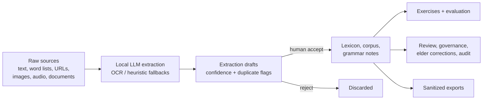

# AssiniLang

A local-first workbench for documenting a language from raw materials and proving a language-learning AI workflow before any real community data is used.

The workspace starts empty. You create a language, feed it raw sources - pasted text, word lists, URLs, images, audio, PDF/DOCX documents - and a local LLM (or offline fallbacks) extracts candidate lexemes, corpus passages, and grammar notes. Every extracted item is a reviewable draft: nothing enters the lexicon, corpus, or grammar data without an explicit human accept, and every corpus passage carries consent and provenance metadata.

On top of the reviewed data sit learner exercises with private answer keys, a deterministic evaluation harness, review policies and dispositions, elder corrections, audit trails, sanitized SHA-256-integrity exports, and AI-session observability.



## Features

- Ingestion: six source kinds, chunked long-source processing, sync or async (202 + polling), SSRF-guarded URL fetch, PDF/DOCX parsing, OCR and transcription paths, duplicate and grounding flags on drafts, crash recovery for interrupted processing.
- Review and governance: single and bulk extraction-draft review, note review queue with per-language policies and approval thresholds, model-drafted notes with automatic grounding scores, review dispositions, elder corrections, audit events.
- Learning and evaluation: server-graded exercises with private answer keys and adversarial probes, spaced-repetition practice recommendations, deterministic evaluation across seven categories, paradigm-gap detection as a fieldwork to-do.
- AI Assistant: grounded chat with the configured local model - natural-language corrections, standing setup instructions, per-reply fallback labeling, conversations that survive reloads.
- Console ergonomics: command palette (Ctrl+K), interlinear glossed text and concordance in the corpus browser, persisted theme/view/language selection.
- Safety boundaries: public projection layer strips answer keys and internals, exports carry SHA-256 integrity manifests, provider keys never reach the browser, corrupted local data fails loudly, validated database backup/restore.

## Quick start

Windows-first (use plain `npm` on macOS/Linux):

```powershell
npm.cmd install
npm.cmd run verify
npm.cmd run dev
```

Web console: `http://localhost:5173` - API: `http://localhost:4321`.

To use a real local model, point the API at an OpenAI-compatible endpoint before `npm.cmd run dev`:

```powershell
$env:ASSINI_LLM_PROVIDER="ollama"
$env:ASSINI_LLM_BASE_URL="http://127.0.0.1:11434/v1"
$env:ASSINI_LLM_MODEL="llama3.1"
```

Without a model, ingestion still works through offline heuristic parsing and local OCR.

## Configuration

The most common variables; the [Configuration Reference](docs/configuration.md) documents all of them with defaults and ready-to-paste recipes.

| Variable | Purpose |
| --- | --- |
| `ASSINI_LLM_PROVIDER` / `ASSINI_LLM_BASE_URL` / `ASSINI_LLM_MODEL` | Select and locate the extraction/chat model. |
| `ASSINI_LLM_API_KEY` | Server-side key for remote endpoints. |
| `ASSINI_TRANSCRIBE_BASE_URL` | Whisper-style endpoint required for audio sources. |
| `ASSINI_OCR_LANG` | OCR language for image sources without a vision model. |
| `ASSINI_ALLOW_PRIVATE_URLS` | Disable the SSRF guard in trusted local setups. |
| `ASSINI_DEV_API_PORT` / `ASSINI_DEV_WEB_PORT` | Alternate dev ports. |

## Common commands

| Command | Purpose |
| --- | --- |
| `npm.cmd run dev` | Start the API and web console together. |
| `npm.cmd run verify` | Full quality gate: tests, type checks, seed, eval, builds. |
| `npm.cmd test` | All Vitest tests. |
| `npm.cmd run check` | TypeScript project checks. |
| `npm.cmd run seed` | Reset to an empty workspace at `data/local-db.json`. |
| `npm.cmd run eval` | Deterministic evaluation CLI. |
| `npm.cmd run build` | Build all workspaces. |
| `npm.cmd run smoke` | End-to-end ingestion smoke script. |
| `npm.cmd run db:backup` | Validated backup of the local database to `data/backups/`. |
| `npm.cmd run demo` | Seed, evaluate, and start the prototype. |

## Documentation

- [Documentation Hub](docs/README.md) - reading paths by what you are trying to do.
- [Product Guide](docs/product-guide.md) - what each workspace does for users.
- [Configuration Reference](docs/configuration.md) - every environment variable, with setup recipes.
- [Ingestion Deep Dive](docs/ingestion.md) - source kinds, processing flow, fallbacks, error catalogue.
- [API Reference](docs/api.md) - full route index, auth model, validation rules.
- [Architecture and Data](docs/architecture.md) - components, data model, persistence, projection.
- [Development Guide](docs/development.md) - setup, quality gate, browser verification, walkthrough.
- [Maintenance Guide](docs/maintenance.md) - recipes for changing routes, views, schema, and docs.
- [Troubleshooting](docs/troubleshooting.md) - symptom, cause, fix.
- [UI Design Guide](docs/ui-design.md) - design system and workspace layouts.
- [Roadmap](docs/roadmap.md) - what must happen before real community data.

## Repository map

```text
apps/api/        Fastify API: domain route modules (src/routes/), ingestion pipeline, LLM/transcription providers, public projection.
apps/web/        React 19 + Vite research console: App shell, per-workspace views (src/views/), shared components and lib helpers.
packages/db/     Zod schemas, integrity validation, migrations, JSON/SQLite store, bootstrap/seed CLI.
packages/eval/   Deterministic study-loop and scoring logic.
packages/api-contract/  Shared API payload/response contracts.
scripts/         Dev/verify launchers, ingestion smoke test, documentation guard tests.
docs/            The handbook, plus dated history under docs/specs and docs/plans.
data/            Generated local database, uploaded assets, OCR cache (gitignored).
```

## Data stewardship

The workspace ships empty. All language data is created by users from raw materials they bring themselves, and every corpus passage carries consent and provenance metadata.

Do not connect real First Nations, Indigenous, or community language data without the governance, consent, access-control, and review infrastructure described in the [Roadmap](docs/roadmap.md). The prototype is a workflow testbed, not a stewardship platform.

## Repository state

The default branch is `master`. The project is intentionally local-first: generated data and build output are ignored by Git, and prototype auth is not production security.
