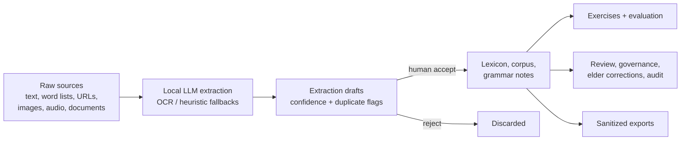

# AssiniLang

A local-first workbench for documenting a language from raw materials and proving a language-learning AI workflow before any real community data is used.

The workspace starts empty. You create a language, feed it raw sources - pasted text, word lists, URLs, allowlisted Obsidian Markdown vaults, images, audio, PDF/DOCX documents - and a local LLM (or offline fallbacks) extracts candidate lexemes, corpus passages, and grammar notes. Extracted candidates enter a review queue: nothing reaches the lexicon, corpus, or grammar data without an explicit human accept, and every corpus passage carries consent and provenance metadata.

On top of the reviewed data sit learner exercises with private answer keys, a deterministic evaluation harness, review policies and dispositions, elder corrections, audit trails, sanitized SHA-256-integrity exports, and AI-session observability.



## Features

- Ingestion: six source kinds plus one-way Obsidian vault import (not live MCP sync), chunked long-source processing, sync or async (202 + polling), SSRF-guarded URL fetch, PDF/DOCX parsing, OCR and transcription paths, duplicate and grounding flags on drafts, crash recovery for interrupted processing.
- Review and governance: single and bulk extraction-draft review, note review queue with per-language policies and approval thresholds, model-drafted notes with automatic grounding scores, review dispositions, elder corrections, audit events.
- Learning and evaluation: server-graded exercises with private answer keys and adversarial probes, spaced-repetition practice recommendations, deterministic evaluation across seven categories, paradigm-gap detection as a fieldwork to-do.
- AI Assistant: grounded chat with the configured local model - natural-language corrections, standing setup instructions, per-reply fallback labeling, conversations that survive reloads.
- Console ergonomics: command palette (Ctrl+K), interlinear glossed text, concordance, and corpus graph in the examples browser, with persisted theme, view, and active language-project selection. The operator interface is English-only; documented target languages remain independent projects.
- Model setup: discovers local/OpenAI-compatible models, saves named model profiles, hot-swaps the active provider, and keeps provider keys server-side.
- Safety boundaries: public projection layer strips answer keys and internals, exports carry SHA-256 integrity manifests, provider keys never reach the browser, corrupted local data fails loudly, validated database backup/restore.

## Quick start

Windows-first (use plain `npm` on macOS/Linux; requires Node `^20.19.0 || >=22.12.0` and npm `>=10`):

```powershell
npm.cmd install
npm.cmd run verify
npm.cmd run dev
```

Web console: `http://localhost:5173` - API: `http://localhost:4321`.

For a desktop window instead of opening a browser tab:

```powershell
npm.cmd run desktop
```

You can also double-click `AssiniLang Desktop.cmd` from this folder on Windows. The desktop launcher starts the API on a private local port and opens the built UI in an AssiniLang window. It builds automatically when the desktop outputs are missing or stale, and skips the build on repeat opens when the current build is still valid. Set `ASSINI_DESKTOP_FORCE_BUILD=1` before launching if you want to force a rebuild.

The desktop app behaves like a single normal app instance: opening it again focuses the existing window, and it remembers the last window size and position. In Settings, Desktop app tools can launch the packaged app at Windows sign-in, hide the window to the tray on close, reset the remembered window layout, show the app version and install folder, show and open the app, local data, settings, backups, diagnostics, and latest-backup paths, show the latest backup and shortcut install status, copy or save redacted diagnostics for troubleshooting, set up both Desktop and Start Menu shortcuts in one click or create them individually, create a timestamped backup before experiments, restore the latest backup after confirming (disabled until at least one backup exists), and prune older backups while keeping the newest 5.

To build a standalone Windows app folder and portable zip:

```powershell
npm.cmd run desktop:package
```

Then open `dist-desktop\Open AssiniLang.cmd`, run `dist-desktop\Install AssiniLang.cmd` once to copy it into your user Programs folder and add Start Menu/Desktop shortcuts, or share `dist-desktop\AssiniLang-win32-x64.zip`. After extracting the zip, users can double-click `Open AssiniLang.cmd` inside the extracted folder; `AssiniLang.exe` still works directly. Packaged desktop data and model settings are stored in the app's user-data folder, so the install folder can stay read-only.

To verify that the packaged app really renders instead of opening to a white screen:

```powershell
npm.cmd run desktop:smoke
```

That command launches the packaged `.exe` with a temporary profile, creates a disposable synthetic workspace whose smoke data is labeled Bisaya, clicks through Start, Build, Practice, and Settings, verifies the model/provider controls, and writes `dist-desktop\desktop-smoke-report.json` plus `dist-desktop\desktop-smoke.png`. The fixture is test data, not a bundled Bisaya language pack or interface mode. Use `npm.cmd run desktop:package:smoke` when you want to rebuild the package and immediately run the visual smoke check.

The Settings tab automatically probes common local OpenAI-compatible endpoints and lists every model they expose. Start or load a model, select it from the dropdown, and switch models without restarting the app. You can also configure a known endpoint before `npm.cmd run dev`:

```powershell
$env:ASSINI_LLM_PROVIDER="ollama"
$env:ASSINI_LLM_BASE_URL="http://127.0.0.1:11434/v1"
$env:ASSINI_LLM_MODEL="llama3.1"
```

Without a model, ingestion still works through offline heuristic parsing and local OCR. Smaller local models can handle chat and simple word-list extraction, but strict structured extraction is the harder workload; use Test connection and the model smoke test in Settings before a long import.

## Configuration

The most common variables; the [Configuration Reference](docs/configuration.md) documents all of them with defaults and ready-to-paste recipes.

| Variable | Purpose |
| --- | --- |
| `ASSINI_LLM_PROVIDER` / `ASSINI_LLM_BASE_URL` / `ASSINI_LLM_MODEL` | Select and locate the extraction/chat model. |
| `ASSINI_LLM_API_KEY` | Server-side key for remote endpoints. |
| `ASSINI_TRANSCRIBE_BASE_URL` | Whisper-style endpoint required for audio sources. |
| `ASSINI_OCR_LANG` | OCR language for image sources without a vision model. |
| `ASSINI_ALLOW_PRIVATE_URLS` | Allow LAN models and private source URLs. Defaults on only for loopback-bound installs; network-facing APIs stay guarded. |
| `ASSINI_DEV_API_PORT` / `ASSINI_DEV_WEB_PORT` | Alternate dev ports. |
| `ASSINI_ALLOW_INSECURE_NETWORK_AUTH` | Explicitly acknowledge prototype auth on a non-loopback API host; never use for production. |

## Common commands

| Command | Purpose |
| --- | --- |
| `npm.cmd run dev` | Start the API and web console together. |
| `npm.cmd run desktop` | Build and open the Electron desktop shell with the API started in the background. |
| `npm.cmd run desktop:package` | Build `dist-desktop\AssiniLang-win32-x64\AssiniLang.exe` plus `dist-desktop\AssiniLang-win32-x64.zip` for a click-to-run Windows desktop release. |
| `npm.cmd run desktop:smoke` | Launch the packaged `.exe` with a temporary profile and verify the rendered desktop UI plus screenshot. |
| `npm.cmd run desktop:package:smoke` | Rebuild the Windows package and immediately run the packaged desktop visual smoke check. |
| `npm.cmd run smoke:web` | Render the built web app in Electron and fail on blank output, fatal renderer events, or console errors. |
| `AssiniLang Desktop.cmd` | Windows double-click launcher for the desktop shell. |
| `npm.cmd run verify` | Full quality gate: tests, type checks, seed, eval, builds. |
| `npm.cmd run verify:beta` | Optional live-model gate; skips cleanly unless `ASSINI_VERIFY_MODEL=1`. |
| `npm.cmd run ci:green` | Fast pre-push production-dependency audit (`npm audit --omit=dev`). |
| `npm.cmd test` | All Vitest tests. |
| `npm.cmd run check` | TypeScript project checks. |
| `npm.cmd run seed` | Reset to an empty workspace at `data/local-db.json`. |
| `npm.cmd run eval` | Deterministic evaluation CLI. |
| `npm.cmd run build` | Build all workspaces. |
| `npm.cmd run smoke` | End-to-end ingestion smoke script. |
| `npm.cmd run smoke:backup` | Backup → corrupt → restore smoke plus CLI refusal / SQLite force / dry-run validation checks (also run in CI). |
| `npm.cmd run model:verify` | Probe discovered local models and run a model-backed language workflow check. |
| `npm.cmd run db:backup` | Validated backup of the local database to `data/backups/`. |
| `npm.cmd run demo` | Seed, evaluate, and start the prototype. |

## Documentation

- [Documentation Hub](docs/README.md) - reading paths by what you are trying to do.
- [Product Guide](docs/product-guide.md) - what each workspace does for users.
- [Configuration Reference](docs/configuration.md) - every environment variable, with setup recipes.
- [Ingestion Deep Dive](docs/ingestion.md) - source kinds, processing flow, fallbacks, error catalogue.
- [API Reference](docs/api.md) - full route index, auth model, validation rules.
- [Architecture and Data](docs/architecture.md) - components, data model, persistence, projection.
- [Development Guide](docs/development.md) - setup, quality gate, browser verification, walkthrough.
- [Maintenance Guide](docs/maintenance.md) - recipes for changing routes, views, schema, and docs.
- [Troubleshooting](docs/troubleshooting.md) - symptom, cause, fix.
- [UI Design Guide](docs/ui-design.md) - design system and workspace layouts.
- [Roadmap](docs/roadmap.md) - what must happen before real community data.

## Repository map

```text
apps/api/        Fastify API: domain route modules (src/routes/), ingestion pipeline, LLM/transcription providers, public projection.
apps/desktop/    Electron desktop shell: starts the API and opens the built web UI in a normal app window.
apps/web/        React 19 + Vite research console: App shell, per-workspace views (src/views/), shared components and lib helpers.
packages/db/     Zod schemas, integrity validation, migrations, JSON/SQLite store, bootstrap/seed CLI.
packages/eval/   Deterministic study-loop and scoring logic.
packages/api-contract/  Shared API payload/response contracts.
scripts/         Dev/verify launchers, ingestion smoke test, documentation guard tests.
docs/            The handbook, plus dated history under docs/specs and docs/plans.
data/            Generated local database, uploaded assets, OCR cache (gitignored).
```

## Data stewardship

The workspace ships empty. All language data is created by users from raw materials they bring themselves, and every corpus passage carries consent and provenance metadata. Do not connect real First Nations, Indigenous, or community language data without the governance, consent, access-control, and review infrastructure described in the [Roadmap](docs/roadmap.md). The prototype is a workflow testbed, not a stewardship platform. The default branch is `master`; generated data and build output are ignored by Git, and prototype auth is not production security.
