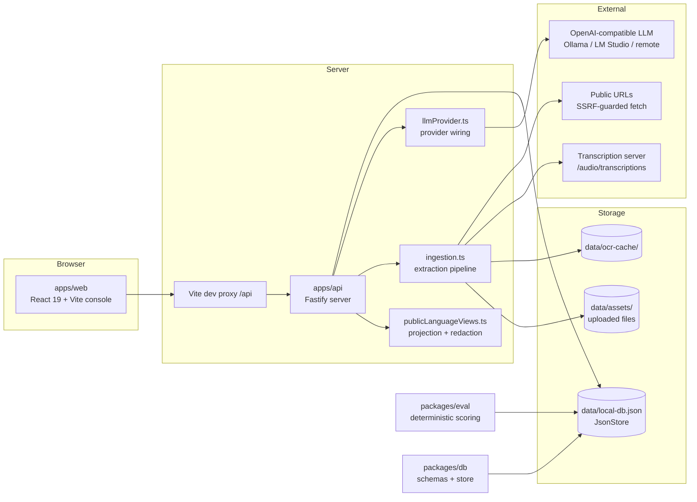
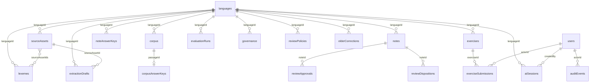

# Architecture and data

AssiniLang is organized as a local-first TypeScript monorepo. The system keeps private answer keys and internal traces in the API/data layer while the web app receives only public or role-appropriate projections.

## Components



## Workspace layout

```text
apps/
  api/                 Fastify API, auth checks, route handlers, raw-source ingestion pipeline, redaction, snapshots, and LLM/transcription provider wiring.
  web/                 React research console.

packages/
  db/                  Zod schemas, TypeScript types, JSON persistence, migrations, and the empty-workspace bootstrap/seed CLI.
  eval/                Deterministic study-loop generation, answer grading, and evaluation scoring.

scripts/               Dev/verify launchers, ingestion smoke test, documentation guard tests.
docs/                  The handbook, plus dated history under docs/specs and docs/plans.
```

## Data flow

1. `npm.cmd run seed` writes an empty workspace to `data/local-db.json`: the local prototype users and no languages.
2. Users create languages through `POST /languages` with name, typology, description, orthography, and an optional phonology inventory.
3. Raw materials are registered or uploaded as source assets: pasted text, word lists, URLs, images, audio, and documents (plain-text formats, PDF, DOCX).
4. `POST /sources/:sourceId/process` runs the ingestion pipeline (synchronously, or in the background with `{ "async": true }`), turning a source asset into proposed extraction drafts.
5. Reviewers accept or reject each draft. Accepted drafts commit lexemes, corpus passages with private answer keys, or grammar notes.
6. The Fastify API reads and mutates the JSON-backed state through `JsonStore`; public projection helpers strip private fields before data reaches the web app.
7. The React app drives ingestion, review, corpus import, exercise submission, governance, exports, and observability workflows through API calls.
8. `npm.cmd run eval` compares drafted and mutable state against immutable answer keys.

## Data model

The persisted app state (`appStateSchema` in `packages/db/src/schema.ts`, `schemaVersion: 8`) holds exactly these collections: `languages`, `corpus`, `corpusAnswerKeys`, `noteAnswerKeys`, `notes`, `exercises`, `exerciseSubmissions`, `evaluationRuns`, `governance`, `users`, `aiSessions`, `elderCorrections`, `auditEvents`, `reviewPolicies`, `reviewApprovals`, `reviewDispositions`, `lexemes`, `sourceAssets`, and `extractionDrafts`.



Ingestion-facing collections:

- `languages`: user-created language records. `status` is `active`, `draft`, or `archived`. Each language may carry an optional `phonology` object (`consonants`, `vowels`, optional `syllableTemplate` and `stress`, `notes`) plus optional `createdBy` and `createdAt` fields.
- `lexemes`: the per-language lexicon. Each lexeme keeps `form`, `gloss`, `partOfSpeech`, `tags`, and `sourceAssetIds` linking it back to the raw materials it came from.
- `sourceAssets`: registered raw materials. `kind` is `text`, `wordlist`, `url`, `image`, `audio`, or `document`; `status` is `pending`, `processing`, `processed`, `failed`, or `archived`. Assets store `rawText`, `url`, or a `filePath` under `data/`, plus an optional `transcript` for audio.
- `extractionDrafts`: reviewable extraction output. `kind` is `lexeme`, `corpus_passage`, or `grammar_note`; each draft carries a `payload`, a `confidence` level, an optional `rationale`, and a `status` of `proposed`, `accepted`, or `rejected` with `reviewedBy`/`reviewedAt` and a `committedEntityId` once accepted.

`consentStatus.use` on corpus passages is an enum (`CONSENT_USE_VALUES`): `testing-only`, `community-approved`, `personal-study`, `research`, `public-domain`, `licensed`, or `pending-review`.

## Ingestion pipeline

Source processing lives in `apps/api/src/ingestion.ts` and is driven by the server-side LLM provider. The [Ingestion Deep Dive](ingestion.md) covers per-kind behavior, chunking and merge rules, sync vs async processing, the SSRF guard, OCR, transcription, duplicate flags, and the error catalogue in detail. The architectural points:

- Per-kind text resolution (URL fetch, transcription, document parsing, OCR) is isolated in the pipeline; the route handler only validates, claims status, and persists results.
- Long sources are chunked (~12,000 characters, up to 8 chunks) and per-chunk results are merged and deduplicated; nothing is silently truncated without a warning.
- Without a configured model, deterministic mode falls back to offline heuristic parsing (and local OCR for images), with explicit warnings on the result.
- `POST /sources/:sourceId/process` with `{ "async": true }` claims the asset as `processing`, returns `202`, and persists completion through the same state mutation as the synchronous path; clients poll the source list.
- Extraction output is never committed directly. Accepting a draft commits a lexeme, a corpus passage (with a derived private answer key; incomplete segmentation falls back to honest token-level "unanalyzed" morphemes), or a grammar note that enters the normal review workflow as a `draft`. Uploaded files are stored under `data/assets/` with a 25 MB cap per file.

## Local persistence

The generated local database lives at `data/local-db.json` (override with `ASSINI_DB_PATH`). `JsonStore` writes through a temporary file and rename so normal writes are atomic.

The current schema version is 8. Legacy v1-v7 local databases migrate forward automatically on read; older state gains empty `lexemes`, `sourceAssets`, and `extractionDrafts` collections and keeps its existing records.

Persisted top-level records must keep stable nonblank unique IDs inside each app-state collection. The schema validates referential integrity during local JSON reads: language IDs on corpus, notes, exercises, lexemes, sourceAssets, extractionDrafts, and governance/review/audit records must resolve to existing languages; answer keys must point at existing same-language passages; actor attribution must use known local users in allowed roles; timestamps must stay parseable and chronologically consistent. Corrupted or manually edited local JSON fails loudly with the exact database path instead of leaking malformed records into public views.

Seeded local databases include six local user identities used by review policies, audit attribution, and backend authorization: learner, Elder, reviewer, lead, programmer, and admin. The web console opens HTTP-only prototype sessions only for learner, Elder, reviewer, and programmer users; lead/admin identities remain server-token authorities for persisted policy ownership and administrative workflows.

Regenerate the empty workspace with:

```powershell
npm.cmd run seed
```

The JSON store is for local development only. Production storage should move to a database with migrations, backups, access control, and operational observability.

## Answer-key separation

The state separates mutable review records from immutable answer keys:

- `notes` are reviewer-facing mutable drafts.
- `noteAnswerKeys` are immutable evaluation references.
- `exercises` are stored with private expected answers and adversarial probes.
- Public exercise responses omit answer keys and grading explanations.
- `exerciseSubmissions` keep learner answers and actor IDs server-side; public submission views redact both fields.
- `corpusAnswerKeys` preserve expected corpus segmentation for evaluation.

This matters because the system must not evaluate itself against whatever a reviewer last edited.

Live corpus imports and accepted corpus extraction drafts both store the passage publicly while deriving a private corpus answer key from the validated target text, translation, and segmentation. Persisted reads reject answer keys that reference missing passages, cross language boundaries, carry blank text or morpheme fields, or lose their own segmentation coverage.

## Public projection layer

Public data shaping belongs in `apps/api/src/publicLanguageViews.ts`. Profiles and snapshots are derived entirely from workspace state:

- Vocabulary comes from the language's lexicon.
- The morpheme inventory is derived from corpus segmentation with occurrence counts, passage IDs, glosses, features, and linked lexeme metadata.
- Grammar rules are the language's public notes.
- Stats include corpus, note, exercise, source-asset, and pending-extraction-draft counts.

There are no fixture minimums or fixture-quality checks; an empty language simply has an empty profile.

Keep these responsibilities in the projection layer:

- Stripping answer keys, adversarial probes, and grading explanations from exercises.
- Removing internal note markers.
- Building language profiles and sanitized language snapshots (`language-snapshot-v2`).
- Building sanitized evaluation artifacts (`evaluation-artifact-v2`).
- Computing visible SHA-256 integrity manifests.

Route handlers should stay focused on auth, validation, mutation, and response status.

## Mutation and audit rules

Mutating API routes append `AuditEvent` records when they change persistent state, including language creation/updates, source registration/upload/processing, and extraction-draft accept/reject. Events record actor and role, action, entity type and ID, language ID, timestamp, a human-readable summary, and minimal metadata.

Audit metadata must not include learner answers, answer keys, provider prompts, hidden model traces, API keys, or other private payloads. Persisted app-state reads reject blank audit fields, private payload keys, and secret-looking string values. Audit events must be attributable to a known local user whose role matches the event, and non-null `languageId` values must reference an existing language (`null` is reserved for global events).

Governance records, review policies, review approvals, review dispositions, and elder corrections keep the same validation and one-way state-transition rules as before: governance writes need Elder/lead/admin approval and a parseable effective date; review-disposition ledger writes are de-duplicated per note, disposition, and open status; elder correction review is a one-way transition out of `pending_review`; review-policy thresholds must fit the assigned reviewer list or the assignable reviewer pool; and approvals are unique per language, note, and reviewer.

## Corpus import integrity

Corpus imports are role-gated and validated before persistence. The API rejects imports when:

- The language ID is unknown.
- The body is malformed.
- Target text duplicates an existing passage for the language.
- A segmentation surface does not appear in the target text.
- A target-text token is not covered by one or more contiguous segmentation surfaces.
- Target text uses a symbol outside the language's declared phonology inventory. This orthography scan runs only when the language declares an inventory; languages without one skip the check.
- A morpheme is not grounded by the language's lexicon (surface or lemma). Grounding is enforced only when the lexicon is non-empty, so early-stage languages can import freely.
- `consentStatus.use` is not one of the `CONSENT_USE_VALUES` enum values.

Successful imports append the passage, derive a private corpus answer key, and write an audit event with source, morpheme count, tag count, consent-use label, and restriction count. Exercise authoring follows the same pattern: rules are validated against the language's notes and note answer keys, and vocabulary against its lexicon once the lexicon is non-empty.

## Evaluation harness

`packages/eval` runs deterministic study-loop and scoring logic. The current evaluation categories are:

- Note coverage.
- Note accuracy.
- Evidence accuracy.
- Segmentation accuracy.
- Translation availability.
- Exercise grading.
- Generation policy.

Most categories use a 96% minimum threshold. Generation policy requires 100% because unapproved forms should never enter learner-facing output. Evaluation runs record `fixtureVersion: "workspace-corpus-v1"` because the evaluated corpus is whatever the workspace currently contains.

Persisted evaluation runs must keep nonblank language IDs that reference an existing language, nonblank system version, fixture version, score categories, and summary text, a parseable creation timestamp, and failure lines that match their parent run's language.

## LLM provider boundary

LLM provider configuration is server-only. The browser can view readiness status but must never receive provider API keys. All provider, transcription, OCR, and URL-guard environment variables are documented in the [Configuration Reference](configuration.md).

`GET /llm/status` reports provider readiness and transcription readiness without exposing keys. Provider errors are sanitized before returning to clients or storing observable session records.

Persisted AI sessions must keep nonblank language and creator IDs, reference an existing language, be created by a known local user whose role is allowed for the session mode, keep nonblank diagnostics and context IDs, and keep parseable timestamps inside the session timeline.
