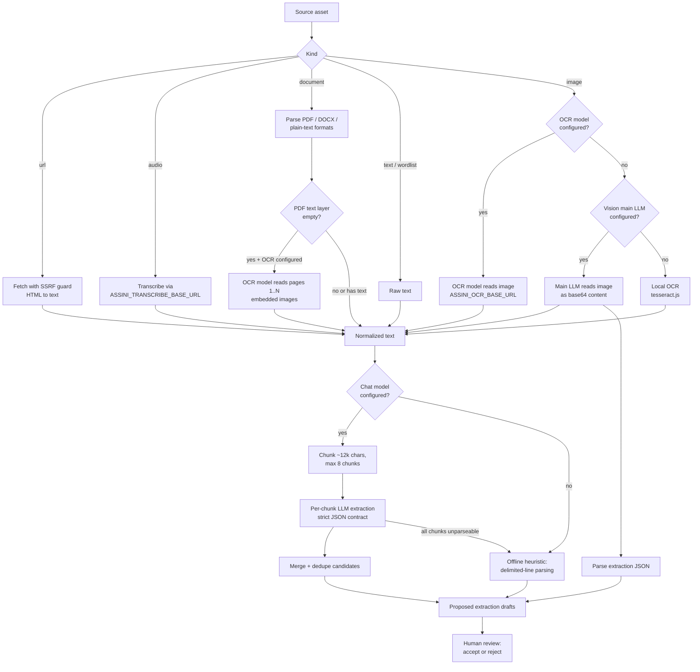

# Ingestion deep dive

This document explains how a raw source becomes reviewable extraction drafts. Candidate parsing and orchestration live in `apps/api/src/ingestion.ts`; URL, document, OCR, and transcription resolvers live in `apps/api/src/ingestionMedia.ts`; source intake routes live in `apps/api/src/routes/sources.ts`; processing and cancellation routes live in `apps/api/src/routes/sourceProcessing.ts`; provider wiring lives in `apps/api/src/llmProvider.ts`. Model and endpoint configuration is covered in the [configuration reference](configuration.md).

## Source kinds

| Kind       | How it gets in                                                      | What it accepts                                                                                | Text resolution                                                                                                                                                           | No-model fallback                                 |
| ---------- | ------------------------------------------------------------------- | ---------------------------------------------------------------------------------------------- | ------------------------------------------------------------------------------------------------------------------------------------------------------------------------- | ------------------------------------------------- |
| `text`     | `POST /languages/:languageId/sources` with `rawText`                | Pasted prose, field notes, stories                                                             | Used as-is                                                                                                                                                                | Offline heuristic parsing of delimited lines      |
| `wordlist` | Same route with `kind: "wordlist"`                                  | Delimited word lists (`form = gloss` and similar)                                              | Used as-is; the model prompt prefers lexeme extraction                                                                                                                    | Offline heuristic parsing                         |
| `url`      | Same route with a `url`                                             | Public http(s) pages, capped at 2 MB                                                           | Server-side fetch, HTML converted to plain text, SSRF guard applied                                                                                                       | Offline heuristic parsing of the fetched text     |
| `image`    | `POST /languages/:languageId/sources/upload` (image MIME/extension) | Photos or scans of printed/handwritten material                                                | OCR model (`ASSINI_OCR_BASE_URL`) when configured; else vision-capable main LLM; else local tesseract.js                                                                  | OCR/tesseract text then offline heuristic parsing |
| `audio`    | Upload (audio MIME/extension)                                       | Recordings                                                                                     | Transcribed via the `ASSINI_TRANSCRIBE_BASE_URL` endpoint; the transcript is stored on the asset and reused on reprocess                                                  | None - transcription endpoint is required         |
| `document` | Upload (everything else)                                            | `txt`, `md`, `markdown`, `csv`, `tsv`, `json`, `text`, plus PDF (`unpdf`) and DOCX (`mammoth`) | File parsed to plain text; scanned PDFs with no text layer use OCR model on pages 1..N (cap via `ASSINI_OCR_PDF_MAX_PAGES`, default 10) when `ASSINI_OCR_BASE_URL` is set | Offline heuristic parsing of the parsed text      |

Uploads are multipart, one file, 25 MB cap, stored under `data/assets/<languageId>/`. The upload route detects the kind from MIME type and extension.

Obsidian vault import is a bulk intake helper, not a separate persisted source kind. `POST /languages/:languageId/sources/obsidian-vault` reads local Markdown files from a vault folder, skips `.obsidian`, `.git`, and `node_modules`, strips common frontmatter and wikilinks, and registers each readable note as a pending `text` source. Notes larger than 1 MB are skipped (not imported) with an operator-facing reason localized as `ingest.vaultMarkdownTooLarge`. Those sources then use the same processing, warnings, draft review, and audit paths as pasted text. Vault folders must sit under `ASSINI_OBSIDIAN_VAULT_ROOTS` (fail-closed when unset); see [configuration](configuration.md#ingestion-safety-and-ocr).

The optional Obsidian MCP bridge is a second intake path. Configure a Streamable HTTP endpoint and optional write-only bearer token in Settings, list resources through `GET /integrations/obsidian-mcp/resources`, then import up to 50 selected URIs with `POST /languages/:languageId/sources/obsidian-mcp`. Only supported non-empty text representations up to 1 MB are accepted. The resource URI is retained on the pending source for provenance and per-language duplicate detection; tokens are excluded from responses, source records, and audit metadata. Imported notes still require normal processing and explicit draft acceptance. This is not live synchronization or write-back.

## Processing flow

The model is asked for a single JSON object with `summary`, `lexemes`, `passages`, and `grammarNotes`. Responses are tolerant-parsed: code fences are stripped and the first balanced JSON object is extracted before Zod validation.

## Chunking and merge rules

Long sources are not truncated. After normalization:

- Text is split on paragraph/line boundaries into chunks of at most ~12,000 characters (`CHUNK_TARGET_CHARS`); a single oversized line is hard-split as a last resort.
- At most 8 chunks (`MAX_CHUNKS_PER_SOURCE`) are processed sequentially; each prompt carries a "part N of M" note. Text beyond 8 chunks is skipped with a warning reporting how many characters were left unprocessed.
- Per-chunk results are merged with deduplication: lexemes by case-insensitive `form`+`gloss`, corpus passages by exact target text, grammar notes by `topic`+`explanation`. Candidates are capped at 100 per kind (`MAX_CANDIDATES_PER_KIND`).
- Chunk summaries are combined and trimmed to ~300 characters.
- A chunk whose model output cannot be parsed is skipped with a warning. If every chunk fails, the pipeline falls back to the offline heuristic on the full text.

## Sync vs async processing

`POST /sources/:sourceId/process` (roles: reviewer, lead, admin) runs synchronously by default: the source is processed, marked `processed` (or `failed` with a sanitized `error`, returning `422`), and the response includes the resulting `proposed` drafts and warnings. Completion is idempotent per source and semantic draft identity: an equivalent pending proposal is reused, an equivalent accepted/rejected decision is not re-proposed, and legacy duplicate pending proposals are collapsed to the earliest record.

Because chunked extraction through a slow local model can take minutes, the route also accepts `{ "async": true }`:

1. The server validates the same preconditions, marks the asset `processing`, writes a `source_asset.process_started` audit event, and returns `202` with `{ asset, drafts: [], warnings: [] }`.
2. Extraction runs in a background task and persists exactly what the synchronous path would: drafts plus `processed` status on success, or `failed` with a sanitized `error` on the asset.
3. Clients poll `GET /languages/:languageId/sources` until the asset leaves `processing`. The web console polls every 2.5 seconds.

A source that is already `processing` returns `409` in both modes. Clearly transient failures (timeouts/408, 429, 502/503/504, temporary DNS, refused/reset connections) receive at most two **in-process** retries after 250 ms and 1 second. Every accepted retry first persists a new `processingAttempts` value and heartbeat plus a categorical `source_asset.process_retry_scheduled` audit event; permanent validation, authentication, unsupported-format, and invalid-output failures are never retried. The five-attempt asset cap still wins, so fewer than two internal retries may remain.

There is no durable auto-resume: a process crash during extraction or backoff loses the live call. The startup recovery sweep (`apps/api/src/jobRecovery.ts`, run from the server's ready hook) resets every asset left in `processing` by a crash to `failed` with the operator-visible error `Processing interrupted by a server restart. Re-run processing.` and a `source_asset.processing_recovered` audit event; the source can then be explicitly reprocessed (see [troubleshooting](troubleshooting.md)). Recovery and process completion both clear `processingStartedAt` / `processingHeartbeatAt`. Failures and recovery keep `processingAttempts`; a successful run clears the counter on the asset, while the start/retry audit events retain truthful attempt history.

Operators can cancel a **pending** (not yet active) background job with `POST /sources/:sourceId/cancel-processing`. That removes the queue entry, marks the asset `failed` with `Queued source processing was cancelled. Use Retry when ready.`, and appends `source_asset.process_cancelled`. Active jobs cannot be cancelled mid-run (`409` / `ingest.sourceProcessingCancelActive`). Source list responses include a non-persisted `processingQueuePhase` (`queued` | `active`) so the console can show Cancel only for queued rows and label in-flight work as processing.

## SSRF guard

URL sources are fetched server-side, so the fetcher refuses to be a proxy into the local network. Unless `ASSINI_ALLOW_PRIVATE_URLS=1` (or `true`):

- Only `http:` and `https:` URLs are accepted.
- `localhost`, `*.localhost`, and `*.local` hostnames are blocked.
- Non-public IPv4 literals are blocked, including unspecified, private, loopback, carrier-grade NAT, link-local, protocol-assignment, documentation, benchmark, multicast, and reserved ranges.
- Non-public IPv6 literals are blocked, including unspecified, loopback, IPv4-mapped, local-use translation, discard-only, benchmark, ORCHID, documentation, unique-local, link/site-local, and multicast ranges.
- Public-looking hostnames are DNS-resolved and the resolved address is checked against the same ranges.
- The approved DNS address is pinned into the actual connection, preventing a second DNS answer from rebinding the request to a private host.

The same outbound boundary protects URL ingestion, LLM/chat and health requests, model discovery, embeddings, OCR, transcription, and Obsidian MCP. Endpoint URLs cannot contain credentials; bearer credentials remain server-side; redirects are blocked before credentials can cross origins; every operation has a deadline; and streamed responses are byte-capped even when the peer omits `Content-Length`. URL-source responses use the narrower 2 MB cap and must contain readable text after HTML stripping. `ASSINI_ALLOW_PRIVATE_URLS=1` deliberately permits trusted loopback/LAN endpoints but does not disable protocol, credential, redirect, timeout, response-size, or error-redaction controls.

## Image OCR pipeline

Image sources resolve text in priority order:

1. **OCR model** — when `ASSINI_OCR_BASE_URL` is set, the image is sent to that OpenAI-compatible `/chat/completions` endpoint with `ASSINI_OCR_MODEL` (default `llava`) and an optional `ASSINI_OCR_API_KEY` bearer token. This lets you use a dedicated vision model separate from the main extraction LLM.
2. **Vision main LLM** — when no OCR model is configured but the main provider is chat-capable, the image is sent as base64 chat content to `ASSINI_LLM_BASE_URL` / `ASSINI_LLM_MODEL`.
3. **Local tesseract fallback** — when neither endpoint is configured (or the model calls above fail and the pipeline falls back), tesseract.js extracts text offline:

- The language comes from `ASSINI_OCR_LANG` (default `eng`).
- The first run for a given language downloads its trained data from the tesseract.js CDN (a few MB, internet required once) and caches it under `data/ocr-cache/`; later runs are offline.
- OCR output feeds the same downstream extraction as pasted text, and the result carries the warning `No vision model configured; used local OCR (tesseract.js) to read the image.`

OCR applies to `image` sources and to scanned PDF `document` sources when the text layer is empty and `ASSINI_OCR_BASE_URL` is configured. For scanned PDFs, pages 1..N are processed up to `ASSINI_OCR_PDF_MAX_PAGES` (default 10): `unpdf` extracts the largest embedded image per page (typical for image-only scans), encodes each as PNG, and sends it to the OCR model. Soft-fail per page (warn + continue). DOCX files with no text layer still fail closed.

## Scanned PDF OCR (documents)

When a PDF upload has no extractable text layer:

1. If `ASSINI_OCR_BASE_URL` is set, pages 1..N are OCR'd via the same vision model path as images (`ocrScannedPdfPages` in `apps/api/src/ingestionMedia.ts`, re-exported by `ingestion.ts`).
2. For each page up to the cap, the largest embedded image is extracted with `unpdf` `extractImages`, written to a temporary PNG, and passed to `ocrImageWithModel`.
3. Successful page texts are concatenated with `--- Page N ---` markers when more than one page is attempted; output continues through the normal text extraction pipeline with `Used configured OCR model to read scanned document (S of A pages).`
4. Per-page failures soft-fail (`OCR failed for page N...` / `OCR skipped page N...`) and processing continues. A page-cap warning is added only when the PDF has more pages than `ASSINI_OCR_PDF_MAX_PAGES`.
5. If the OCR model is not configured, or every attempted page fails with no readable text, processing fails with guidance to set `ASSINI_OCR_BASE_URL` or export pages as images.

Limitations: pages beyond the configured cap are not read; PDFs that rasterize pages without embedded images cannot be OCR'd in-process (export those pages as images and upload them instead). DOCX OCR is not implemented yet; empty DOCX text layers fail with a localized `ingest.ocrDocxUnsupported` hint in Build.

## Transcription (audio)

Audio assets are sent as multipart form data to `<ASSINI_TRANSCRIBE_BASE_URL>/audio/transcriptions` with `model` from `ASSINI_TRANSCRIBE_MODEL` (default `whisper-1`) and an optional `ASSINI_TRANSCRIBE_API_KEY` bearer token. The returned transcript is stored on the asset (`transcript`) and flows through normal text extraction. Reprocessing reuses the stored transcript instead of transcribing again.

## Duplicate flags on drafts

`GET /languages/:languageId/extraction-drafts` (roles: reviewer, lead, admin) computes a read-time `duplicate` flag on proposed drafts. Flags are advisory, computed per request, never persisted, and never block accept/reject. Each draft gets at most one flag; existing-entity matches win over pending matches.

| Flag kind | Badge in the web console           | Meaning                                                                                                                                                         |
| --------- | ---------------------------------- | --------------------------------------------------------------------------------------------------------------------------------------------------------------- |
| `exact`   | "Duplicate of existing entry"      | Case-insensitive lexeme `form`+`gloss` match, or case/whitespace-insensitive corpus target-text match, against committed workspace data (`{ kind, entityId }`). |
| `form`    | "Same form, different gloss"       | A lexeme form already exists with a different gloss - a possible homonym or gloss refinement.                                                                   |
| `topic`   | "Duplicate topic"                  | A grammar-note draft repeats an existing note topic.                                                                                                            |
| `pending` | "Duplicates another pending draft" | A later draft proposes the same thing as an earlier still-proposed draft (`{ kind: "pending", draftId }`).                                                      |

## Grounding flags on drafts

The same listing also computes a read-time `grounding` array (`{ kind, message }[]`) on proposed drafts, checking each draft against the accepted lexicon of its language. Like duplicate flags, grounding flags are advisory: computed per request, never persisted, and they never block accept/reject. No flags are produced when the lexicon is empty.

| Flag kind               | Badge in the web console                | Meaning                                                                                                                                                                                                                       |
| ----------------------- | --------------------------------------- | ----------------------------------------------------------------------------------------------------------------------------------------------------------------------------------------------------------------------------- |
| `gloss_conflict`        | "Conflicts with accepted gloss"         | A lexeme draft's form exactly matches an accepted lexeme (case-insensitive trim compare) but proposes a different gloss.                                                                                                      |
| `decomposable_form`     | "Form decomposes into accepted lexemes" | A lexeme draft's form is fully covered by a concatenation of 2-3 accepted lexeme forms (e.g. `talune` = `talu` "water" + `ne` "locative case marker"), so the model may have glossed a multi-morpheme word as one new lexeme. |
| `segmentation_conflict` | "Segment gloss conflicts with lexicon"  | A corpus-passage draft's segmentation glosses a surface differently from the accepted lexeme with the same form.                                                                                                              |

When a proposed corpus draft carries `segmentation_conflict`, the listing also includes a read-time `lexiconSegmentationProposal` (lexicon longest-match morphemes for the draft target text) so Build can show draft glosses vs the lexicon side by side. Reviewers resolve via accept: keep the draft (no body), prefer lexicon (`preferLexiconSegmentation: true`), or accept an edited gloss list (`morphologicalSegmentation`).

## Error catalogue

Errors from processing mark the source `failed` with a sanitized message and return `422` (sync) or land on the asset's `error` field (async). Route-level errors return their listed status.

| Error (user-facing)                                                                                                                                                                         | Status         | Cause                                                                                                                                                           | Fix                                                                                                                                                                     |
| ------------------------------------------------------------------------------------------------------------------------------------------------------------------------------------------- | -------------- | --------------------------------------------------------------------------------------------------------------------------------------------------------------- | ----------------------------------------------------------------------------------------------------------------------------------------------------------------------- |
| `Invalid source body: provide kind (text                                                                                                                                                    | wordlist       | url), title, and rawText or url`                                                                                                                                | 400                                                                                                                                                                     | Malformed registration body | Match the body shape for the chosen kind. |
| `Upload requires a multipart file field` / `Uploaded file is empty`                                                                                                                         | 400            | Bad multipart upload                                                                                                                                            | Send one non-empty file field.                                                                                                                                          |
| `Source not found: ...` / `Language not found: ...`                                                                                                                                         | 404            | Unknown IDs                                                                                                                                                     | Check the source/language ID.                                                                                                                                           |
| `Source is already processing: ...` (`i18nKey: ingest.sourceAlreadyProcessing`)                                                                                                             | 409            | A sync or async run is in flight (or a crash left the asset stuck)                                                                                              | Wait for polling to finish; after a crash, see [troubleshooting](troubleshooting.md).                                                                                   |
| `Source processing attempt limit reached (5).` (`i18nKey: ingest.sourceMaxProcessingAttempts`)                                                                                              | 409            | Five failed or abandoned claims (`processingAttempts` ≥ 5); successful runs clear the counter, but once capped further process calls on this asset stay blocked | Inspect the asset error/history and fix the underlying failure, or register a fresh source — retrying the same capped asset keeps returning `409`.                      |
| `Processing interrupted by a server restart. Re-run processing.` (`i18nKey: ingest.processingInterruptedByRestart`)                                                                         | asset `failed` | Startup recovery sweep reset a crash-stuck `processing` asset                                                                                                   | Re-run processing; see [troubleshooting](troubleshooting.md).                                                                                                           |
| `Source URL is not a valid URL: ...` / `Source URLs must use http or https.`                                                                                                                | 422            | Unparseable URL or wrong scheme                                                                                                                                 | Use a full http(s) URL.                                                                                                                                                 |
| `Source URL points at a private or local network ... and was blocked.`                                                                                                                      | 422            | SSRF guard blocked the hostname/IP                                                                                                                              | Use a public URL, or set `ASSINI_ALLOW_PRIVATE_URLS=1` in a trusted local setup.                                                                                        |
| `Obsidian vault import is disabled until ASSINI_OBSIDIAN_VAULT_ROOTS is set ...` / `Obsidian vault path is outside the configured ASSINI_OBSIDIAN_VAULT_ROOTS allowlist.`                   | 400            | Vault roots unset, or path outside allowlist (`..` / symlink escapes included)                                                                                  | Set `ASSINI_OBSIDIAN_VAULT_ROOTS` to semicolon-separated absolute roots and import a path under one of them.                                                            |
| `Source URL hostname ... resolves to a private or local network address and was blocked.`                                                                                                   | 422            | DNS resolved to a private range                                                                                                                                 | Same as above.                                                                                                                                                          |
| `Fetching source URL failed with status N.`                                                                                                                                                 | 422            | The remote server returned an error                                                                                                                             | Check the URL is reachable and public.                                                                                                                                  |
| `Source URL content is too large to process locally.` (`i18nKey: ingest.urlContentTooLarge`)                                                                                                | 422            | Response over 2 MB                                                                                                                                              | Save the relevant part as text and paste or upload it.                                                                                                                  |
| `Markdown file is larger than the 1 MB import limit.` (`i18nKey: ingest.vaultMarkdownTooLarge`)                                                                                             | vault skip     | Obsidian note over 1 MB                                                                                                                                         | Split or shorten the note, then import again.                                                                                                                           |
| `Payload too large` (`i18nKey: errors.payloadTooLarge`)                                                                                                                                     | 413            | JSON body over `ASSINI_BODY_LIMIT_BYTES` (default 64 KB) or multipart upload over the 25 MB file cap                                                            | Shrink the JSON payload or upload a smaller file.                                                                                                                       |
| `Source URL returned no readable text content.`                                                                                                                                             | 422            | Page had no extractable text                                                                                                                                    | Paste the text manually.                                                                                                                                                |
| `Audio sources need a transcription endpoint. Set ASSINI_TRANSCRIBE_BASE_URL ...` (`i18nKey: ingest.transcribeNotConfigured`)                                                               | 422            | No transcription server configured                                                                                                                              | Configure a whisper-style server; see [configuration](configuration.md#transcription-audio-sources).                                                                    |
| `Transcription request failed with status N.` / `Transcription request failed: ...` / `Transcription endpoint returned no text.` / `... invalid JSON.` (`i18nKey: ingest.transcribeFailed`) | 422            | Transcription server error, network failure, empty result, or malformed JSON                                                                                    | Check the server, model name, and audio file.                                                                                                                           |
| `OCR model request failed with status N.` / `OCR model endpoint returned no text.` / `... invalid JSON.` / `... no choices.` (`i18nKey: ingest.ocrModelFailed`)                             | 422            | OCR model server error, empty result, or malformed response                                                                                                     | Check `ASSINI_OCR_BASE_URL`, `ASSINI_OCR_MODEL`, and that the vision model is loaded (for example `ollama pull llava`).                                                 |
| `Local OCR could not read the image: ...` (`i18nKey: ingest.ocrNoReadableText`)                                                                                                             | 422            | Tesseract fallback failed (often `OCR found no readable text in the image.`)                                                                                    | Provide a clearer image, set `ASSINI_OCR_LANG` to match the script, or configure `ASSINI_OCR_BASE_URL` / a vision-capable main LLM.                                     |
| `The configured model returned no usable result for this image. It may not be vision-capable. ... leaving the model unset.` (`i18nKey: ingest.visionModelRequired`)                         | 422            | An image source was sent to a configured but non-vision main LLM with no OCR model                                                                              | Configure `ASSINI_OCR_BASE_URL` with a vision model, set a vision-capable `ASSINI_LLM_MODEL`, or leave the main model unset so the image falls back to local tesseract. |
| `The model response could not be parsed as extraction JSON. Try again or use a larger model.`                                                                                               | 422            | A vision model replied with non-JSON output                                                                                                                     | Retry, or use a model that follows JSON instructions.                                                                                                                   |
| `Configured OCR model could not read the scanned PDF: ...` (`i18nKey: ingest.ocrModelFailed`) / `The PDF has no embedded page image to OCR. ...` (`i18nKey: ingest.ocrPdfNoImage`)          | 422            | Every attempted page failed OCR, or no page had an embedded image                                                                                               | Check `ASSINI_OCR_BASE_URL` / `ASSINI_OCR_MODEL`, confirm the vision model is loaded, or export pages as images and upload them.                                        |
| `The PDF contains no extractable text — it may be a scanned image. Configure ASSINI_OCR_BASE_URL with a vision-capable OCR model to read scanned PDFs.`                                     | 422            | Scanned/image-only PDF and no OCR model configured                                                                                                              | Set `ASSINI_OCR_BASE_URL` (for example a local llava server) or export pages as images and upload those.                                                                |
| `The document contains no extractable text — it may be a scanned image; OCR is not supported yet.`                                                                                          | 422            | Empty DOCX text layer                                                                                                                                           | Same as above.                                                                                                                                                          |
| `Document type .X is not supported yet. Upload a PDF, DOCX, plain-text, Markdown, or CSV file, or convert it first.`                                                                        | 422            | Unsupported document extension                                                                                                                                  | Convert to a supported format.                                                                                                                                          |
| `Text source asset has no content.` / `... has no stored file.` / `URL source asset has no URL.`                                                                                            | 422            | The asset record is incomplete (usually hand-edited state)                                                                                                      | Re-register or re-upload the source.                                                                                                                                    |
| `Source contains no readable text.` (`i18nKey: ingest.sourceNoReadableText`)                                                                                                                | 422            | Resolved text was empty after normalization                                                                                                                     | Check the source content.                                                                                                                                               |

Warnings (extraction still succeeds, result is flagged). Processing warnings are persisted on the source asset (`warnings`) and surfaced in the Build tab under the source, so a user can see when processing fell back to a heuristic or OCR rather than only inferring it from low-confidence drafts:

| Warning                                                                                                                                                                | Meaning                                                                                                                      |
| ---------------------------------------------------------------------------------------------------------------------------------------------------------------------- | ---------------------------------------------------------------------------------------------------------------------------- |
| `No model configured (deterministic mode); used offline heuristic parsing.` (`i18nKey: ingest.warningDeterministicHeuristic`)                                          | No real model is set up; only delimited lines were parsed, at low confidence.                                                |
| `Model output was not valid extraction JSON; fell back to offline heuristics.` (`i18nKey: ingest.warningOfflineHeuristicFallback`)                                     | The model replied with unparseable output; heuristics ran instead.                                                           |
| `Model extraction failed for part N of M: ...; fell back to offline heuristics when no usable model output remained.` (`i18nKey: ingest.warningModelExtractionFailed`) | A chunk's model call threw (timeout, reasoning-only reply, abort); heuristics covered that part after secrets were redacted. |
| `Model output for part N of M was not valid extraction JSON; that part was skipped.` (`i18nKey: ingest.warningChunkParseSkipped`)                                      | One chunk of a long source failed to parse; the rest merged normally.                                                        |
| `Source text is very long; only the first 8 parts were processed and N characters were skipped.` (`i18nKey: ingest.warningChunkCapSkipped`)                            | The source exceeded the chunk cap.                                                                                           |
| `No vision model configured; used local OCR (tesseract.js) to read the image.` (`i18nKey: ingest.warningLocalOcrUsed`)                                                 | The tesseract fallback path ran for an image source (no OCR model or vision LLM succeeded).                                  |
| `Used configured OCR model to read the image.` (`i18nKey: ingest.ocrImageUsed`)                                                                                        | The `ASSINI_OCR_BASE_URL` endpoint read the image successfully.                                                              |
| `Used configured OCR model to read scanned document (S of A pages).` (`i18nKey: ingest.ocrPdfUsed`)                                                                    | A scanned PDF with no text layer was OCR'd via embedded page images (S succeeded of A attempted).                            |
| `PDF has N pages; only the first M pages were OCR'd. Raise ASSINI_OCR_PDF_MAX_PAGES...` (`i18nKey: ingest.ocrPdfMultiPageWarning`)                                     | Scanned PDF exceeded the OCR page cap (`ASSINI_OCR_PDF_MAX_PAGES`, default 10).                                              |
| `OCR failed for page N; continuing with remaining pages.` (`i18nKey: ingest.ocrPdfPageFailed`) / `OCR skipped page N...` (`i18nKey: ingest.ocrPdfPageSkipped`)         | Soft-fail for one page; other pages may still succeed.                                                                       |

## After extraction

Extraction output is never committed directly. Accepting a draft (`POST /extraction-drafts/:draftId/accept`) commits a lexeme, a corpus passage with consent `pending-review` and a derived private answer key (incomplete segmentation falls back to honest token-level "unanalyzed" morphemes), or a `draft` grammar note that enters the normal review queue. See the [API reference](api.md#extraction-drafts) for validation details.

## Shared provider with model-backed generation

The model-backed generation features - grounded draft notes (`POST /languages/:languageId/study-loop/model-draft`) and a grounded draft exercise (`POST /languages/:languageId/exercises/generate`) - reuse the same configured LLM provider as ingestion (the OpenAI-compatible chat/completions endpoint), so the same `ASSINI_LLM_*` configuration enables them. Unlike ingestion, they have no offline heuristic fallback: in deterministic / no-model mode each generation route returns `400` instead of degrading. See the [API reference](api.md#model-backed-generation) for the grounding rules.
