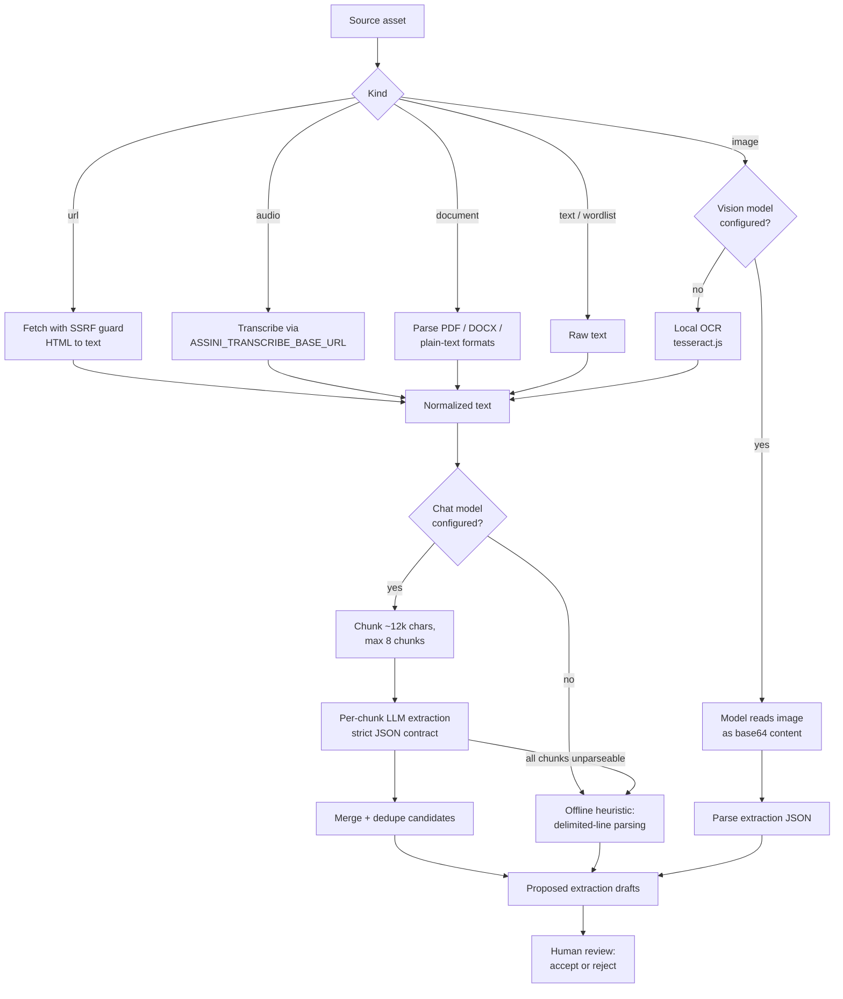

# Ingestion deep dive

This document explains how a raw source becomes reviewable extraction drafts. The pipeline lives in `apps/api/src/ingestion.ts`; the routes that drive it live in `apps/api/src/routes/sources.ts`; provider wiring lives in `apps/api/src/llmProvider.ts`. Model and endpoint configuration is covered in the [configuration reference](configuration.md).

## Source kinds

| Kind | How it gets in | What it accepts | Text resolution | No-model fallback |
| --- | --- | --- | --- | --- |
| `text` | `POST /languages/:languageId/sources` with `rawText` | Pasted prose, field notes, stories | Used as-is | Offline heuristic parsing of delimited lines |
| `wordlist` | Same route with `kind: "wordlist"` | Delimited word lists (`form = gloss` and similar) | Used as-is; the model prompt prefers lexeme extraction | Offline heuristic parsing |
| `url` | Same route with a `url` | Public http(s) pages, capped at 2 MB | Server-side fetch, HTML converted to plain text, SSRF guard applied | Offline heuristic parsing of the fetched text |
| `image` | `POST /languages/:languageId/sources/upload` (image MIME/extension) | Photos or scans of printed/handwritten material | Vision-capable model reads the image directly; otherwise local OCR (tesseract.js) extracts text first | OCR text then offline heuristic parsing |
| `audio` | Upload (audio MIME/extension) | Recordings | Transcribed via the `ASSINI_TRANSCRIBE_BASE_URL` endpoint; the transcript is stored on the asset and reused on reprocess | None - transcription endpoint is required |
| `document` | Upload (everything else) | `txt`, `md`, `markdown`, `csv`, `tsv`, `json`, `text`, plus PDF (`unpdf`) and DOCX (`mammoth`) | File parsed to plain text | Offline heuristic parsing of the parsed text |

Uploads are multipart, one file, 25 MB cap, stored under `data/assets/<languageId>/`. The upload route detects the kind from MIME type and extension.

## Processing flow

The model is asked for a single JSON object with `summary`, `lexemes`, `passages`, and `grammarNotes`. Responses are tolerant-parsed: code fences are stripped and the first balanced JSON object is extracted before Zod validation.

## Chunking and merge rules

Long sources are not truncated. After normalization:

- Text is split on paragraph/line boundaries into chunks of at most ~12,000 characters (`CHUNK_TARGET_CHARS`); a single oversized line is hard-split as a last resort.
- At most 8 chunks (`MAX_CHUNKS_PER_SOURCE`) are processed sequentially; each prompt carries a "part N of M" note. Text beyond 8 chunks is skipped with a warning reporting how many characters were left unprocessed.
- Per-chunk results are merged with deduplication: lexemes by case-insensitive `form`+`gloss`, corpus passages by exact target text, grammar notes by `topic`+`explanation`. Candidates are capped at 100 per kind (`MAX_CANDIDATES_PER_KIND`).
- Chunk summaries are combined and trimmed to ~300 characters.
- A chunk whose model output cannot be parsed is skipped with a warning. If every chunk fails, the pipeline falls back to the offline heuristic on the full text.

## Sync vs async processing

`POST /sources/:sourceId/process` (roles: reviewer, lead, admin) runs synchronously by default: the source is processed, marked `processed` (or `failed` with a sanitized `error`, returning `422`), and the response includes the new `proposed` drafts and warnings.

Because chunked extraction through a slow local model can take minutes, the route also accepts `{ "async": true }`:

1. The server validates the same preconditions, marks the asset `processing`, writes a `source_asset.process_started` audit event, and returns `202` with `{ asset, drafts: [], warnings: [] }`.
2. Extraction runs in a background task and persists exactly what the synchronous path would: drafts plus `processed` status on success, or `failed` with a sanitized `error` on the asset.
3. Clients poll `GET /languages/:languageId/sources` until the asset leaves `processing`. The web console polls every 2.5 seconds.

A source that is already `processing` returns `409` in both modes. There is no in-process resume, but a startup recovery sweep (`apps/api/src/jobRecovery.ts`, run from the server's ready hook) resets every asset left in `processing` by a crash to `failed` with the operator-visible error `Processing interrupted by a server restart. Re-run processing.` and a `source_asset.processing_recovered` audit event; the source can then be reprocessed normally (see [troubleshooting](troubleshooting.md)).

## SSRF guard

URL sources are fetched server-side, so the fetcher refuses to be a proxy into the local network. Unless `ASSINI_ALLOW_PRIVATE_URLS=1` (or `true`):

- Only `http:` and `https:` URLs are accepted.
- `localhost`, `*.localhost`, and `*.local` hostnames are blocked.
- Private/reserved IPv4 literals are blocked: 0/8, 10/8, 127/8, 169.254/16, 172.16/12, 192.168/16.
- Loopback, link-local, and unique-local IPv6 literals are blocked: `::1`, fe80::/10, fc00::/7, plus IPv4-mapped forms.
- Public-looking hostnames are DNS-resolved and the resolved address is checked against the same ranges.

Responses are capped at 2 MB and must contain readable text after HTML stripping.

## OCR fallback (images)

When no chat-capable model is configured, image sources go through local OCR with tesseract.js:

- The language comes from `ASSINI_OCR_LANG` (default `eng`).
- The first run for a given language downloads its trained data from the tesseract.js CDN (a few MB, internet required once) and caches it under `data/ocr-cache/`; later runs are offline.
- OCR output feeds the same downstream extraction as pasted text, and the result carries the warning `No vision model configured; used local OCR (tesseract.js) to read the image.`
- When a vision-capable model is configured, the image is sent as base64 chat content instead and OCR never runs.

OCR applies only to `image` sources. Scanned PDFs with no text layer fail with an explicit error; convert pages to images or run external OCR first.

## Transcription (audio)

Audio assets are sent as multipart form data to `<ASSINI_TRANSCRIBE_BASE_URL>/audio/transcriptions` with `model` from `ASSINI_TRANSCRIBE_MODEL` (default `whisper-1`) and an optional `ASSINI_TRANSCRIBE_API_KEY` bearer token. The returned transcript is stored on the asset (`transcript`) and flows through normal text extraction. Reprocessing reuses the stored transcript instead of transcribing again.

## Duplicate flags on drafts

`GET /languages/:languageId/extraction-drafts` computes a read-time `duplicate` flag on proposed drafts. Flags are advisory, computed per request, never persisted, and never block accept/reject. Each draft gets at most one flag; existing-entity matches win over pending matches.

| Flag kind | Badge in the web console | Meaning |
| --- | --- | --- |
| `exact` | "Duplicate of existing entry" | Case-insensitive lexeme `form`+`gloss` match, or case/whitespace-insensitive corpus target-text match, against committed workspace data (`{ kind, entityId }`). |
| `form` | "Same form, different gloss" | A lexeme form already exists with a different gloss - a possible homonym or gloss refinement. |
| `topic` | "Duplicate topic" | A grammar-note draft repeats an existing note topic. |
| `pending` | "Duplicates another pending draft" | A later draft proposes the same thing as an earlier still-proposed draft (`{ kind: "pending", draftId }`). |

## Grounding flags on drafts

The same listing also computes a read-time `grounding` array (`{ kind, message }[]`) on proposed drafts, checking each draft against the accepted lexicon of its language. Like duplicate flags, grounding flags are advisory: computed per request, never persisted, and they never block accept/reject. No flags are produced when the lexicon is empty.

| Flag kind | Badge in the web console | Meaning |
| --- | --- | --- |
| `gloss_conflict` | "Conflicts with accepted gloss" | A lexeme draft's form exactly matches an accepted lexeme (case-insensitive trim compare) but proposes a different gloss. |
| `decomposable_form` | "Form decomposes into accepted lexemes" | A lexeme draft's form is fully covered by a concatenation of 2-3 accepted lexeme forms (e.g. `talune` = `talu` "water" + `ne` "locative case marker"), so the model may have glossed a multi-morpheme word as one new lexeme. |
| `segmentation_conflict` | "Segment gloss conflicts with lexicon" | A corpus-passage draft's segmentation glosses a surface differently from the accepted lexeme with the same form. |

## Error catalogue

Errors from processing mark the source `failed` with a sanitized message and return `422` (sync) or land on the asset's `error` field (async). Route-level errors return their listed status.

| Error (user-facing) | Status | Cause | Fix |
| --- | --- | --- | --- |
| `Invalid source body: provide kind (text|wordlist|url), title, and rawText or url` | 400 | Malformed registration body | Match the body shape for the chosen kind. |
| `Upload requires a multipart file field` / `Uploaded file is empty` | 400 | Bad multipart upload | Send one non-empty file field. |
| `Source not found: ...` / `Language not found: ...` | 404 | Unknown IDs | Check the source/language ID. |
| `Source is already processing: ...` | 409 | A sync or async run is in flight (or a crash left the asset stuck) | Wait for polling to finish; after a crash, see [troubleshooting](troubleshooting.md). |
| `Source URL is not a valid URL: ...` / `Source URLs must use http or https.` | 422 | Unparseable URL or wrong scheme | Use a full http(s) URL. |
| `Source URL points at a private or local network ... and was blocked.` | 422 | SSRF guard blocked the hostname/IP | Use a public URL, or set `ASSINI_ALLOW_PRIVATE_URLS=1` in a trusted local setup. |
| `Source URL hostname ... resolves to a private or local network address and was blocked.` | 422 | DNS resolved to a private range | Same as above. |
| `Fetching source URL failed with status N.` | 422 | The remote server returned an error | Check the URL is reachable and public. |
| `Source URL content is too large to process locally.` | 422 | Response over 2 MB | Save the relevant part as text and paste or upload it. |
| `Source URL returned no readable text content.` | 422 | Page had no extractable text | Paste the text manually. |
| `Audio sources need a transcription endpoint. Set ASSINI_TRANSCRIBE_BASE_URL ...` | 422 | No transcription server configured | Configure a whisper-style server; see [configuration](configuration.md#transcription-audio-sources). |
| `Transcription request failed with status N.` / `Transcription endpoint returned no text.` | 422 | Transcription server error or empty result | Check the server, model name, and audio file. |
| `Local OCR could not read the image: ... Configure a vision-capable model via ASSINI_LLM_PROVIDER ...` | 422 | OCR failed (often `OCR found no readable text in the image.`) | Provide a clearer image or configure a vision model such as llava. |
| `The configured model returned no usable result for this image. It may not be vision-capable. Configure a vision model (for example llava via Ollama) in ASSINI_LLM_MODEL, or rely on the local OCR fallback by leaving the model unset.` | 422 | An image source was sent to a configured but non-vision model | Either configure a vision model (for example `llava`) in `ASSINI_LLM_MODEL`, or leave the model unset so the image falls back to local OCR. |
| `The model response could not be parsed as extraction JSON. Try again or use a larger model.` | 422 | A vision model replied with non-JSON output | Retry, or use a model that follows JSON instructions. |
| `The PDF contains no extractable text — it may be a scanned image; OCR is not supported yet.` | 422 | Scanned/image-only PDF | Convert pages to images and upload those, or OCR externally. |
| `The document contains no extractable text — it may be a scanned image; OCR is not supported yet.` | 422 | Empty DOCX text layer | Same as above. |
| `Document type .X is not supported yet. Upload a PDF, DOCX, plain-text, Markdown, or CSV file, or convert it first.` | 422 | Unsupported document extension | Convert to a supported format. |
| `Text source asset has no content.` / `... has no stored file.` / `URL source asset has no URL.` | 422 | The asset record is incomplete (usually hand-edited state) | Re-register or re-upload the source. |
| `Source contains no readable text.` | 422 | Resolved text was empty after normalization | Check the source content. |

Warnings (extraction still succeeds, result is flagged). Processing warnings are persisted on the source asset (`warnings`) and surfaced in the Sources & intake view under the source, so a user can see when processing fell back to a heuristic or OCR rather than only inferring it from low-confidence drafts:

| Warning | Meaning |
| --- | --- |
| `No model configured (deterministic mode); used offline heuristic parsing.` | No real model is set up; only delimited lines were parsed, at low confidence. |
| `Model output was not valid extraction JSON; fell back to offline heuristics.` | The model replied with unparseable output; heuristics ran instead. |
| `Model output for part N of M was not valid extraction JSON; that part was skipped.` | One chunk of a long source failed to parse; the rest merged normally. |
| `Source text is very long; only the first 8 parts were processed and N characters were skipped.` | The source exceeded the chunk cap. |
| `No vision model configured; used local OCR (tesseract.js) to read the image.` | The OCR fallback path ran for an image source. |

## After extraction

Extraction output is never committed directly. Accepting a draft (`POST /extraction-drafts/:draftId/accept`) commits a lexeme, a corpus passage with consent `pending-review` and a derived private answer key (incomplete segmentation falls back to honest token-level "unanalyzed" morphemes), or a `draft` grammar note that enters the normal review queue. See the [API reference](api.md#extraction-drafts) for validation details.

## Shared provider with model-backed generation

The model-backed generation features - grounded draft notes (`POST /languages/:languageId/study-loop/model-draft`) and a grounded draft exercise (`POST /languages/:languageId/exercises/generate`) - reuse the same configured LLM provider as ingestion (the OpenAI-compatible chat/completions endpoint), so the same `ASSINI_LLM_*` configuration enables them. Unlike ingestion, they have no offline heuristic fallback: in deterministic / no-model mode each generation route returns `400` instead of degrading. See the [API reference](api.md#model-backed-generation) for the grounding rules.
